[](http://quantlet.de/)

## [](http://quantlet.de/) **RCVJ_Forecasting** [](http://quantlet.de/)

```yaml

Name of Quantlet: RCVJ_Forecasting

Published in: Realized Cryptocurrencies Volatility Forecasting with Jumps

Description: In this paper, to investigate the realized volatility of the highly volatile cryptocurrencies asset, we employ threhold realized variance method to separate jump component apart from continuous process. Despite that the jump process doesn’t improve explanation power, we can still find that jump brings information. The one-day lagged threshold jump component has significant positive impact on the future realized volatility, this suggest that we are likely to find cryptocurrency market more volatile after jumps happened one day before. However, the un-threshold jump component is negatively correlated to the future realized volatility significantly.

Keywords: Realized volatility, Cryptocurrencies, Global Market Indices, ACF

Author: Junjie Hu

Submitted: 26.03.2019

```

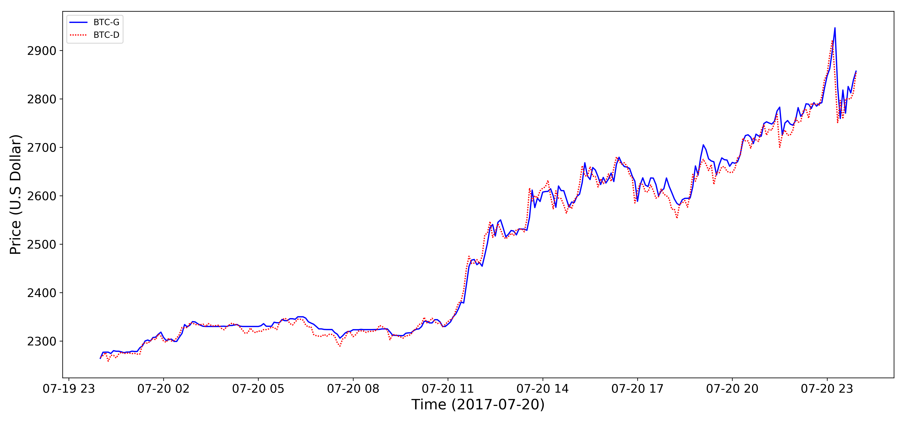

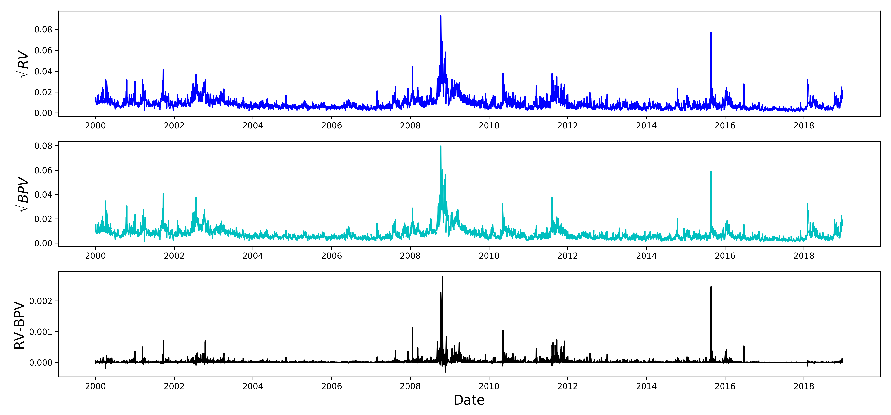

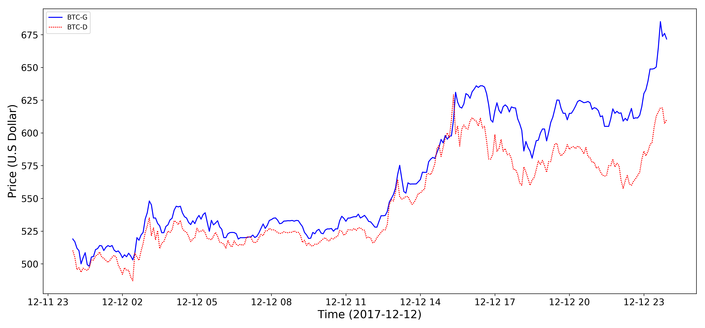

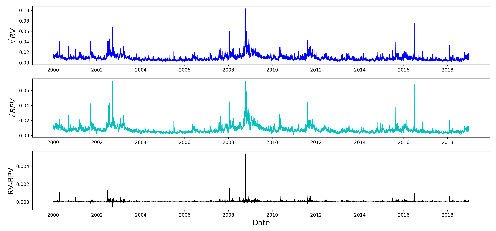

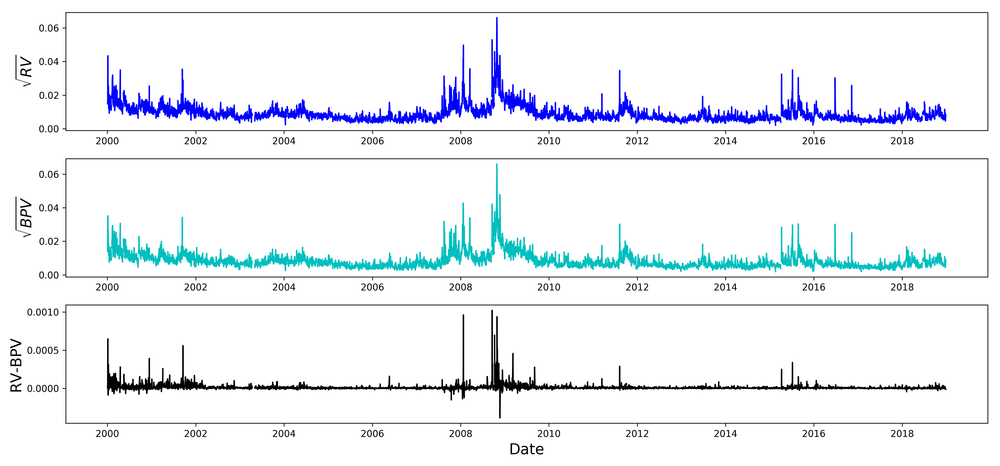

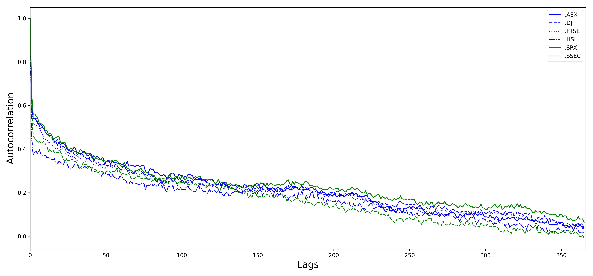

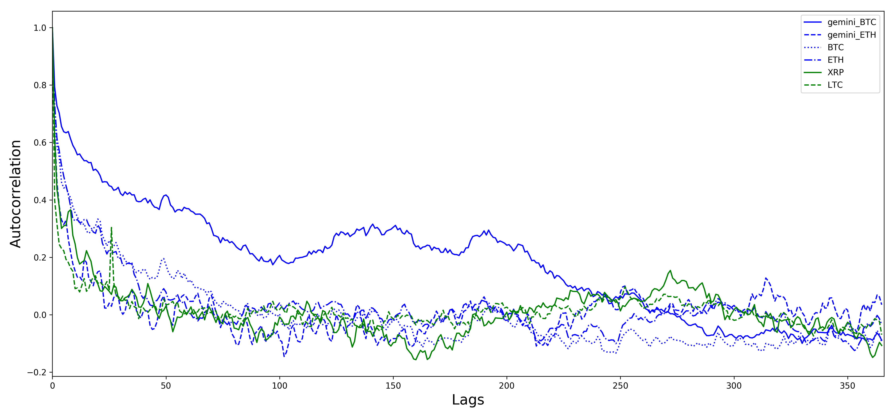

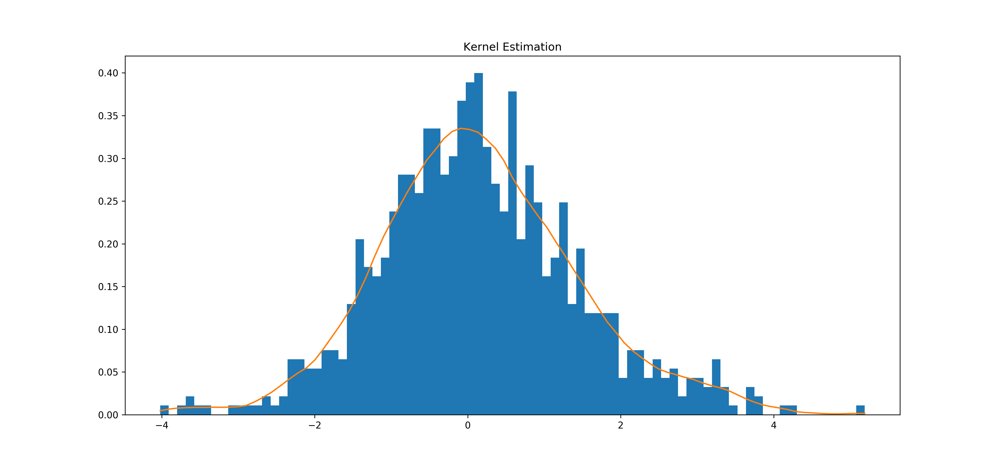

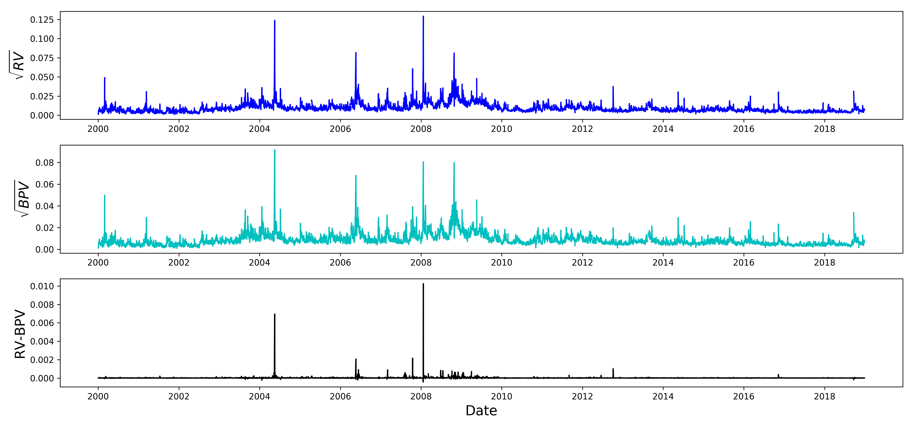

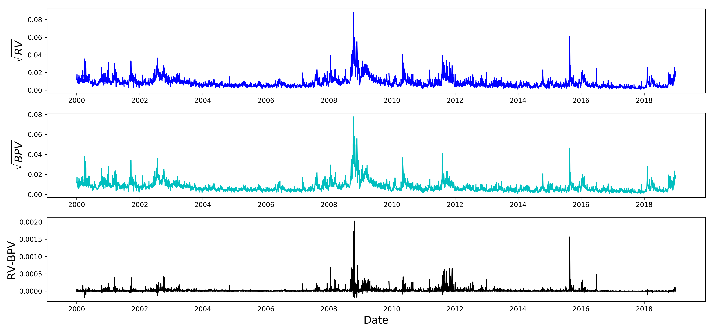

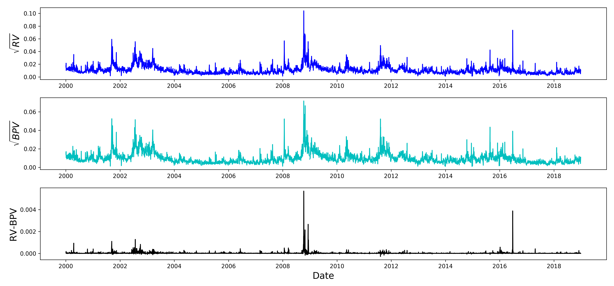

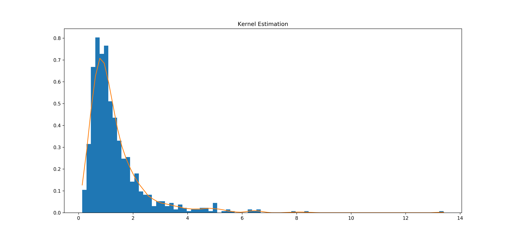

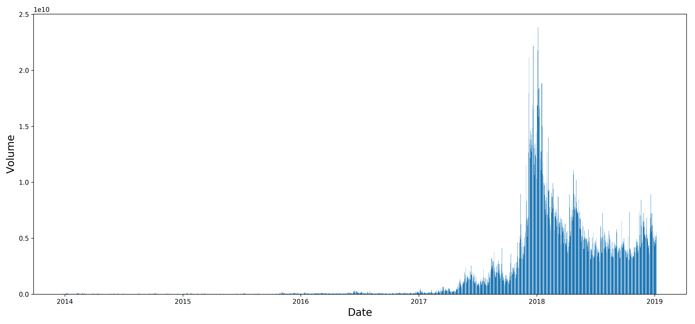

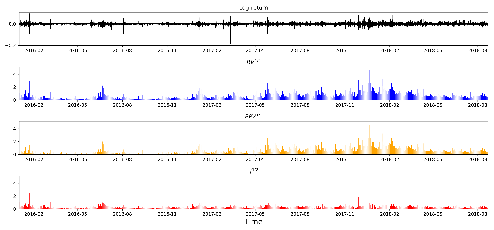


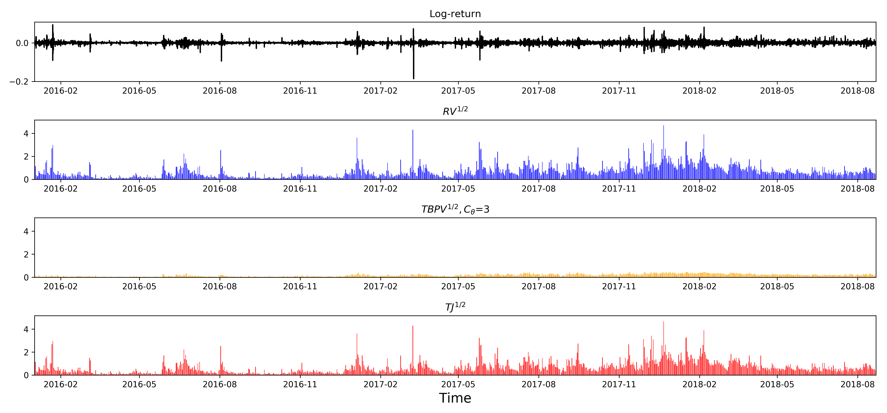


### PYTHON Code
```python

import pandas as pd
import numpy as np
import os
import matplotlib as mpl
import pickle

mpl.use('TKAgg')
import matplotlib.pyplot as plt
import datetime as dt
from Code.RCVJ_RealizedVolatility.CAL_RV_BPV import All_RVs_Separation
from Code.RCVJ_RealizedVolatility.CAL_RV_BPV import CAL_AllRVs
from Code.RCVJ_RealizedVolatility.PLT_Funcs import *
from Code.RCVJ_DataOperation.IO_Funcs import read_coin_return, read_indices_full_RV, read_indices_trading_rv_bpv
from statsmodels.nonparametric.kde import KDEUnivariate as uni_kde

class RealizedVolatilityPlot_OneAsset:
    """

    Calculate realized volatility
    rv_t+1 = sum_i(r_t,i^2)
    """

    root_dir = os.getcwd()
    data_dir = root_dir + '/Data/'
    outdata_dir = root_dir + '/Output/Data/'
    outplot_dir = root_dir + '/Output/Plot/'

    def __init__(self, return_ts: pd.Series, rv: pd.Series, asset_name, ts_freq, **kwargs):
        self.logreturn = return_ts
        self.rv = rv
        self.asset_name = asset_name
        self.freq = ts_freq

    def plt_threshold_realized_jumps(self, bpv, jump, **kwargs):
        # self.threshold_rvs = threshold_realized_volatility_separation(ts_df=self.logreturn, cv=cv)
        # ctrvs = self.threshold_rvs[0]
        # rv = self.rvs[0]
        # ctrvs['ct_jumps'] = rv.values - ctrvs['C_TBPV'].to_frame().values
        title_rv = '$RV^{1/2}$' if 'title_rv' not in kwargs else kwargs['title_rv']
        title_bpv = '$BPV^{1/2},$' if 'title_bpv' not in kwargs else kwargs['title_bpv']
        title_jump = '$Jump^{1/2}$' if 'title_jump' not in kwargs else kwargs['title_jump']

        trvs_fig = plot_RV_separation(return_df=self.logreturn,
                                      rv=self.rv,
                                      bpv=bpv,
                                      jump=jump,
                                      title_rv=title_rv,
                                      title_bpv=title_bpv,
                                      title_jump=title_jump
                                      )

        # trvs_fig.savefig(outplot_dir + f'RV_Separation/{self.coin_name}_{self.freq}_{cv}_CThresholdJumps.png', dpi=300)
        return trvs_fig


    def plt_logretrun_distribution(self, logreturn=None, drop_zero=False, rand_sample_size=None, replace=False):

        # ====================== Plot distribution of log returns

        data_df = logreturn

        var_name = 'logreturn'
        coin_name = 'BTC'
        freq = '5min'
        logreturn = read_dyos_clean(coin_name)

        logreturn = logreturn[logreturn.index.date >= dt.date(2017, 1, 1)]

        logreturn_drop_zero = logreturn[~(logreturn[f'{coin_name}_5min'] == 0)]

        value_count = logreturn_drop_zero[f'{coin_name}_5min'].value_counts()

        # =========Test for
        high_counts = value_count.head(1).index[0]
        high_counts_day = logreturn_drop_zero[logreturn_drop_zero['BTC_5min'] == high_counts]
        high_counts_day['day'] = high_counts_day.index.date
        counts_day = high_counts_day['day'].value_counts()
        close_price = pd.read_csv(data_dir + f'/{coin_name}_USDT.csv', index_col=0, parse_dates=True)['close']
        volume = pd.read_csv(data_dir + f'/{coin_name}_USDT.csv', index_col=0, parse_dates=True)['volume']
        high_days = counts_day.head(20).index
        for high_day in high_days:
            high_day_price = close_price[close_price.index.date == high_day]
            plt.figure(figsize=(15, 5))
            plt.plot(high_day_price)
            plt.title(f'Intraday Close Price, {high_day}')
            plt.savefig(outplot_dir + f"HighFreqSameReturn/OneDaySample_{high_day}.png", dpi=300)

        # =========Finish Test

        top_values = value_count[value_count > 1]
        values_todrop = top_values.index
        logreturn_dropped = logreturn_drop_zero[~(logreturn_drop_zero[f'{coin_name}_5min'].isin(values_todrop))]
        data_df = logreturn_dropped
        # value_count_after = logreturn_dropped['BTC_5min'].value_counts()

        histogram = plot_logreturn_hist(data_df=data_df,
                                        bins=20000,
                                        hist_density=False,
                                        drop_zero=drop_zero,
                                        random_sample_size=rand_sample_size,
                                        replace=replace,
                                        xlabel='Log-return')

        # kernel_plotter = PlotKernelDensityEstimator(data_points=data_df.values,
        #                                             file_name=f'KDE/KDE_{coin_name}_{var_name}')
        # kernel_plotter.band_widths = [0.1, 0.2, 0.3, 0.4, 0.5, 0.6, 0.7, 0.8, 0.9, 1.0]
        # kernel_plotter.x_plot = np.linspace(data_df.min(), data_df.max(), 100000)
        # kernel_plotter.log_density_estimate()
        # kernel_plotter.plot_curve_hist_kde(log_dens=kernel_plotter.log_densities['0.1'], bin_num=20000, hist_density=True)
        # kernel_plotter.save_plot(dir=outplot_dir, num_bin=40000, hist_density=True)

        # histogram.savefig(outplot_dir + f'{self.coin_name}_{self.freq}_logreturn_distribution.png', dpi=300)
        histogram[0].savefig(outplot_dir + f'{coin_name}_{freq}_logreturn_distribution_2017.png', dpi=500)

    def plt_kernel_estimation(self, ts=None, bin_num=1000, bandwidth=None, bd_method='silverman', hist_density=True, var_name='RV', cv=3):

        # ====================== Plot kernel estimation
        # plot kernel estimation
        kde_dir = outplot_dir + f'KDE/KDE_{self.asset_name}/'
        os.makedirs(kde_dir, exist_ok=True)
        kernel_plotter = PlotKernelDensityEstimator(data_points=ts.values)
        kde_fig = kernel_plotter.plot_curve_hist_kde(bin_num=bin_num, hist_density=hist_density, bandwidth=bandwidth, method=bd_method)
        op_bd = round(kernel_plotter.band_width, 2)
        kde_file_name = kde_dir + f'{var_name}_{kernel_plotter.kernel}_{op_bd}_cv{cv}_{self.freq}.png'
        kde_fig.savefig(kde_file_name, dpi=300)
        kde_fig.close()


    def plt_local_variation_estimate(self, cv, logreturn):
        # ====== plot local variation estimate
        try:
            self.threshold_rvs
        except NameError:
            self.threshold_rvs = All_RVs_Separation(ts_df=logreturn, cv=cv)

        ts_v = self.threshold_rvs[1]
        fig, ax = plt.subplots(figsize=(15, 7))
        ax.plot(ts_v['V_est'])
        plt.xticks(fontsize=16)
        plt.yticks(fontsize=14)
        ax.set_title('Local Variation Estimate')
        fig.savefig(outplot_dir + 'local_variation_estimate.png', dpi=300)

    # def plt_trvs_with_diffcvs(self, cvs):
    #     # =========plot threshold realized jumps with different cvs
    #     for cv in cvs:
    #         self.plt_threshold_realized_jumps(cv)

    def plt_highlow_rvs_intraday(self, logreturn):
        # =======
        # rv, bpv, jump = self.rvs
        # rv_crypto_sort = rv.sort_values(by='RV', axis=0, ascending=False)
        # bpv_crypto_sort = bpv.sort_values(by='BPV', axis=0, ascending=False)

        high_vol_date = dt.date(2018, 1, 16)
        low_vol_date = dt.date(2016, 10, 6)

        t1 = logreturn[logreturn.index.date == high_vol_date]
        t2 = logreturn[logreturn.index.date == low_vol_date]

        plt.figure(figsize=(15, 5))
        plt.subplot(2, 1, 1)
        plt.plot(t1, color='blue')
        plt.ylim(-0.08, 0.03)
        plt.ylabel('Log Return', fontsize=16)
        plt.title(f"Return on High Volatility Day ({high_vol_date.strftime('%Y-%m-%d')})")

        plt.subplot(2, 1, 2)
        plt.plot(t2, color='blue')
        plt.title(f"Return on Low Volatility Day ({low_vol_date.strftime('%Y-%m-%d')})")
        plt.ylim(-0.08, 0.03)
        plt.ylabel('Log Return', fontsize=16)
        plt.tight_layout()
        plt.savefig('high_low_volatility.png', dpi=300)


def open_func(coin, freq, var_name, cv):
    with open(outdata_dir + f'CTRVS_{coin}_{freq}/{var_name}_{cv}.pkl', 'rb') as var_file:
        var = pickle.load(var_file)
    return var


def write_func(coin, freq, var_name, data, cv):
    with open(outdata_dir + f'CTRVS_{coin}_{freq}/{var_name}_{cv}.pkl', 'wb') as var_file:
        pickle.dump(data, var_file)


def plot_crypto_jumpseparation(coin='gemini_BTC', freq='5min', cv=3, alpha=0.99, refresh=True):
    # coin = 'gemini_BTC'
    # freq = '5min'
    # cv = 3
    # alpha = 0.99
    # refresh = True

    all_RVs, estimation, logreturn = CAL_AllRVs(coin=coin,
                                                freq=freq,
                                                refresh=refresh,
                                                sample_num=288,
                                                refresh_est=True,
                                                cv=cv,
                                                truncate_zero=False,
                                                alpha=alpha,
                                                annualized=False,
                                                tz_lag=0)


    """
    'RV', 'BPV', 'TPV', 'z', 'Jump_raw', 'Jump_sig', 'CTBPV', 'CTTPV', 'ctz', 'CTJump_raw', 'CTJump_sig'
    """

    rv = all_RVs['RV']
    bpv = all_RVs['BPV']
    ctpv = all_RVs['CTBPV']
    jump_raw = all_RVs['Jump_raw']
    jump_sig = all_RVs[f'Jump_{alpha}']
    tjump = all_RVs['CTJump_raw']
    tjump_sig = all_RVs[f'CTJump_{alpha}']

    plotter = RealizedVolatilityPlot_OneAsset(return_ts=logreturn, rv=rv, bpv=bpv, asset_name=coin, ts_freq=freq)
    rv_plot_dir = outplot_dir + f'RV_Separation/{coin}/'
    os.makedirs(rv_plot_dir, exist_ok=True)

    # Plot threshold RV separation
    # Raw Jump from BPV
    # jump = rv - bpv
    rvs_fig = plotter.plt_threshold_realized_jumps(bpv=bpv,
                                                   jump=jump_raw,
                                                   title_bpv='$BPV^{1/2}$',
                                                   title_jump='$J^{1/2}$')

    rvs_fig.savefig(f'{rv_plot_dir}{coin}_{freq}_BPVRawJumps_{cv}.png', dpi=300)
    plt.close()

    # BPV significant Jumps
    rvs_sig_fig = plotter.plt_threshold_realized_jumps(bpv=bpv,
                                                       jump=jump_sig,
                                                       title_bpv='$BPV^{1/2}$',
                                                       title_jump='$J^{1/2},$' + r'$\alpha$' + f"$={alpha}$")

    rvs_sig_fig.savefig(f'{rv_plot_dir}{coin}_{freq}_BPVSignificantJumps_{cv}_{alpha}.png', dpi=300)
    plt.close()

    # CTBPV raw Jumps
    ctrvs_fig = plotter.plt_threshold_realized_jumps(bpv=ctpv,
                                                     jump=tjump,
                                                     title_bpv='$TBPV^{1/2},$' + r'$C_\theta$' + f"={cv}",
                                                     title_jump='$TJ^{1/2}$')

    ctrvs_fig.savefig(f'{rv_plot_dir}{coin}_{freq}_CTRawJumps_{cv}.png', dpi=300)
    plt.close()

    # CTBPV significant Jumps

    ctrvs_sig_fig = plotter.plt_threshold_realized_jumps(bpv=ctpv,
                                                         jump=tjump_sig,
                                                         title_bpv='$TBPV^{1/2},$' r'$C_\theta$' + f"={cv}",
                                                         title_jump='$TJ^{1/2},$' + r'$\alpha$' + f"$={alpha}$")

    ctrvs_sig_fig.savefig(f'{rv_plot_dir}{coin}_{freq}_CTBPVSignificantJumps_{cv}_{alpha}.png', dpi=300)
    plt.close()

    # plt.plot(all_RVs[f'Jump_raw'])


def plot_index_jumpsepa(index):
    print(index)
    indices_plot_dir = outplot_dir + 'indices_rv/'
    os.makedirs(indices_plot_dir, exist_ok=True)

    rv, bpv, jump = read_indices_trading_rv_bpv()
    rv_asset = rv[index]
    bpv_asset = bpv[index]
    jump_asset = jump[index]

    plt.figure(figsize=(15, 7))
    plt.title(index, fontsize=16)
    plt.subplot(3, 1, 1)
    plt.plot(np.sqrt(rv_asset), color='b')
    plt.ylabel("$\sqrt{RV}$", fontsize=16)

    plt.subplot(3, 1, 2)
    plt.plot(np.sqrt(bpv_asset), color='c')
    plt.ylabel('$\sqrt{BPV}$', fontsize=16)

    plt.subplot(3, 1, 3)
    plt.plot(jump_asset, color='k')
    plt.ylabel('RV-BPV', fontsize=16)

    plt.xlabel('Date', fontsize=16)
    plt.tight_layout()
    plt.savefig(indices_plot_dir + f'{index[1:]}.png', dpi=300)
    plt.close()


def plot_all_indices_rvjump():
    all_indices = ['.AEX', '.AORD', '.BFX', '.BSESN', '.BVLG', '.BVSP', '.DJI', '.FCHI', '.FTMIB', '.FTSE', '.GDAXI',
                   '.GSPTSE', '.HSI', '.IBEX', '.IXIC', '.KS11', '.KSE', '.MXX', '.N225', '.NSEI', '.OMXC20', '.OMXHPI',
                   '.OMXSPI', '.OSEAX', '.RUT', '.SMSI', '.SPX', '.SSEC', '.SSMI', '.STI', '.STOXX50E']

    for index in all_indices:
        # index = '.FCHI'
        plot_index_jumpsepa(index)


def plot_kde(ts, rv_name, coin='gemini_BTC', freq='5min', cv=3, bd_method='silverman'):
    # coin = 'gemini_BTC'
    # freq = '5min'
    # cv = 3
    # alpha = 0.99
    # refresh = True

    # Plot histogram of ts, bpv, ctbpv, c-jump, jump


    # KDE on RV

    ts = ts[~(ts == 0)]
    log_ts =np.log(ts)
    sqrt_ts = np.sqrt(ts)
    bin_num = int(len(ts)/10)

    plotter = RealizedVolatilityPlot_OneAsset(return_ts=logreturn, rv=ts, asset_name=coin, ts_freq=freq)

    plotter.plt_kernel_estimation(ts=log_ts, bin_num=bin_num, hist_density=True, var_name=f'Log_{rv_name}',cv=cv, bd_method=bd_method)

    plotter.plt_kernel_estimation(ts=sqrt_ts,bin_num=bin_num, hist_density=True, var_name=f'Sqrt_{rv_name}',cv=cv)

    plotter.plt_kernel_estimation(ts=ts/ts.mean(), bin_num=bin_num, hist_density=True, var_name=f'norm_{rv_name}',cv=cv)

    plotter.plt_kernel_estimation(ts=sqrt_ts/sqrt_ts.mean(), bin_num=bin_num, hist_density=True, var_name=f'norm_Sqrt_{rv_name}',cv=cv)

    plotter.plt_kernel_estimation(ts=log_ts/log_ts.mean(), bin_num=bin_num, hist_density=True, var_name=f'norm_Log_{rv_name}',cv=cv)


def plot_crypto_kde(coin, freq, cv):

    all_RVs, estimation, logreturn = CAL_AllRVs(coin=coin,
                                                freq=freq,
                                                refresh=True,
                                                refresh_est=False,
                                                cv=cv,
                                                truncate_zero=False,
                                                alpha=0.99,
                                                annualized=True,
                                                tz_lag=0)

    all_RVs.dropna(axis=0, inplace=True)


    # KDE on BPV
    rv = all_RVs['RV']
    bpv = all_RVs['BPV']
    tbpv = all_RVs['CTBPV']
    # jump_sig = all_RVs['Jump_0.99']
    # tjump_sig = all_RVs['CTJump_0.99']
    plot_kde(ts=rv, rv_name='RV', coin=coin, freq=freq, cv=cv, bd_method='silverman')
    plot_kde(ts=bpv, rv_name='BPV', coin=coin, freq=freq, cv=cv, bd_method='silverman')
    plot_kde(ts=tbpv, rv_name='TBPV', coin=coin, freq=freq, cv=cv, bd_method='silverman')
    # plot_kde(ts=jump_sig, rv_name='JumpSig', coin=coin, freq=freq, cv=cv)
    # plot_kde(ts=tjump_sig, rv_name='TJump_sig', coin=coin, freq=freq, cv=cv)

def plot_indices_kde():
    all_indices = ['.AEX', '.AORD', '.BFX', '.BSESN', '.BVLG', '.BVSP', '.DJI', '.FCHI', '.FTMIB', '.FTSE', '.GDAXI',
                   '.GSPTSE', '.HSI', '.IBEX', '.IXIC', '.KS11', '.KSE', '.MXX', '.N225', '.NSEI', '.OMXC20', '.OMXHPI',
                   '.OMXSPI', '.OSEAX', '.RUT', '.SMSI', '.SPX', '.SSEC', '.SSMI', '.STI', '.STOXX50E']

    rv = read_indices_full_RV()

    for index in all_indices:
        print(index)
        rv_index = rv[index]
        plot_kde(ts=rv_index,rv_name='RV', coin=index, freq='5min', cv=3)


plot_crypto_kde(coin='gemini_BTC', freq='5min', cv=3)
plot_crypto_kde(coin='BTC', freq='5min', cv=3)
plot_crypto_kde(coin='gemini_ETH', freq='5min', cv=3)
plot_crypto_kde(coin='ETH', freq='5min', cv=3)


coins = ['gemini_BTC', 'gemini_ETH']
freqs = ['5min', '10min', 'min']
cvs = [1, 2, 3, 4, 5, 6, 7, 8, 9]
# logreturn_hf, default = read_coin_diff_freq(coin)
coin = coins[0]
freq = freqs[0]
cv = 3
sample_num = 288
all_RVs, estimation, logreturn = CAL_AllRVs(coin, freq,
                                            refresh=True,
                                            refresh_est=False,
                                            sample_num=sample_num,
                                            cv=cv,
                                            truncate_zero=True,
                                            alpha=0.99,
                                            annualized=True,
                                            tz_lag=0)

# plot daily price, rv, big significant jumps
sp_date = dt.date(2017, 3, 10)
coin_data = read_clean_gemini(coin, freq, True)
tj_sorted = all_RVs[f'CTJump_0.99'].sort_values(ascending=False)
high_tj_dates = tj_sorted.head(10).index

close = coin_data['Close']
close_daily = close.groupby(by=close.index.date, axis=0).apply(lambda x: x.tail(1).sum())

# close['date'] = close.index.date
# close_hightj = close[close['date'].isin(high_tj_dates)]
# close_hightj.drop('date',axis=1,inplace=True)
# close_hightj.plot()

close_daily.plot()
rv_sigjump = all_RVs[['RV', 'CTJump_0.99']]

plt.figure(figsize=(15, 8))
plt.subplot(3, 1, 1)
plt.plot(close_daily, color='black')
plt.subplot(3, 1, 2)
plt.plot(rv_sigjump['RV'], color='blue')
ax3 = plt.subplot(3, 1, 3)
plt.plot(rv_sigjump['CTJump_0.99'], color='red')
# Add stripe
for timestamp in high_tj_dates:
    ax3.axvline(x=timestamp, linewidth=2, color='green')

plot_crypto_jumpseparation(coin, freq, cv, 0.99)

# Use BPV to separate jumps:
jump_sep_plotter = RealizedVolatilityPlot_OneAsset(logreturn, asset_name=coin, ts_freq=freq)
jump_sep_fig = jump_sep_plotter.plt_threshold_realized_jumps(rv=all_RVs['RV'], bpv=all_RVs['BPV'],
                                                             jump=all_RVs['Jump_raw'],
                                                             cv=3,
                                                             title_bpv='$BPV^{1/2}$',
                                                             title_jump='$Jump^{1/2}$')

jump_sep_fig.savefig(outplot_dir + f'RV_Separation/{coin}_{freq}_BPVsep_jump_trunc.png', dpi=300)

diff = all_RVs['CTJump_raw'] - all_RVs['Jump_raw']
sort_diff = diff.sort_values(axis=0, ascending=False)
# coin_data = read_clean_gemini(coin, freq, True)


logreturn_sp = logreturn[logreturn.index.date == sp_date]
vol_sp = coin_data[coin_data.index.date == sp_date]['Volume']
fig = plt.figure(figsize=(15, 8))
plt.subplot(2, 1, 1)
# plt.scatter(x=logreturn_sp.index, y=logreturn_sp.values)
plt.plot(logreturn_sp, color='r', linestyle='--')
plt.ylabel('Log-return', fontsize=17)

plt.subplot(2, 1, 2)
plt.plot(vol_sp)
plt.ylabel('Volume', fontsize=17)
plt.xlabel('Time', fontsize=17)
plt.tight_layout()
fig.savefig(outplot_dir + 'extremly_volatile_day.png', dpi=300)


```

automatically created on 2019-04-03